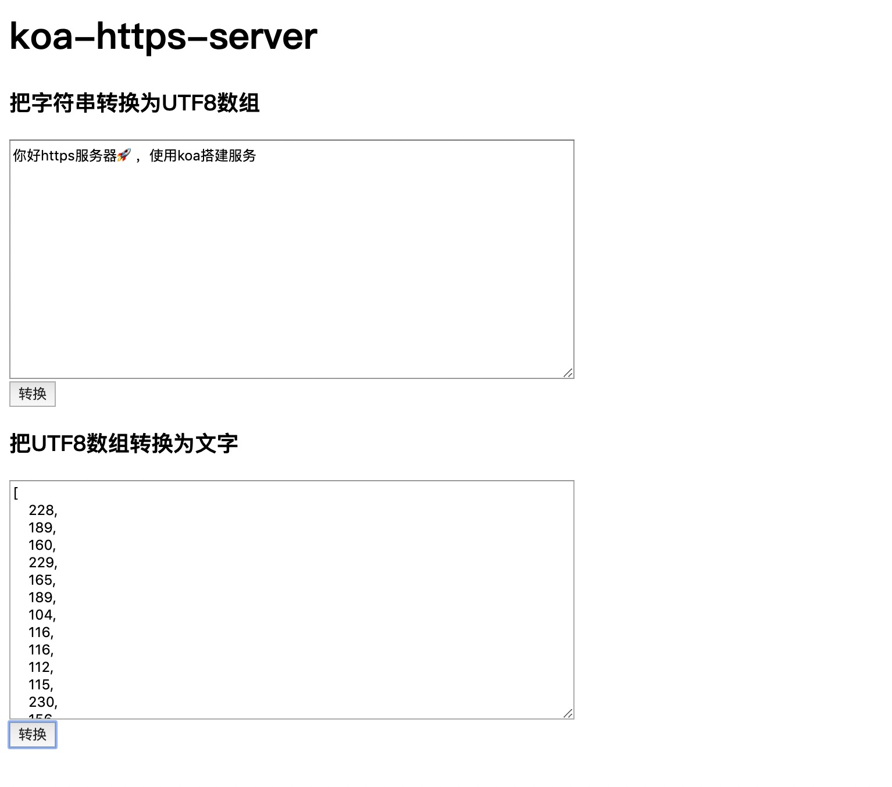

# https 服务器证书生成示例

https 服务器示例

## 生成证书步骤

```bash
# 1. 生成私钥
openssl genrsa -out ssl.key 2048

# 2. 试用私钥生成证书
openssl req -new -key ssl.key -out ssl.csr

# 3. 自签名，生成私有证书，自签名的原理是用私钥对该私钥生成的证书请求进行签名，生成证书文件。该证书的签发者就是自己
openssl x509 -req -in ssl.csr -signkey ssl.key -out ssl.crt
```

参考文章：https://www.cnblogs.com/kyrios/p/tls-and-certificates.html

## 使用 koa 启动 http 和 https 服务器

1. 启动服务

```bash
# 安装依赖
npm i

# 启动服务
npm start
```

2. 在浏览器打开：http://localhost:8080 和 https://localhost:8081 ，打开https服务器会有安全警告，直接忽略就好


